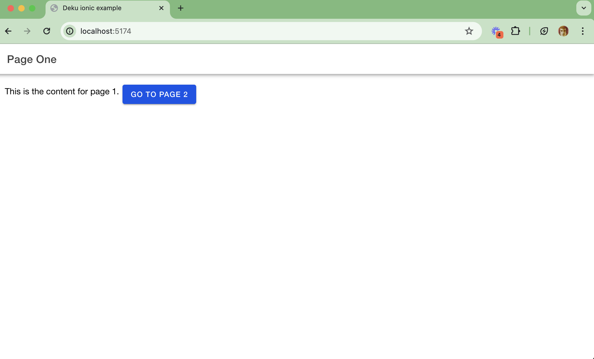
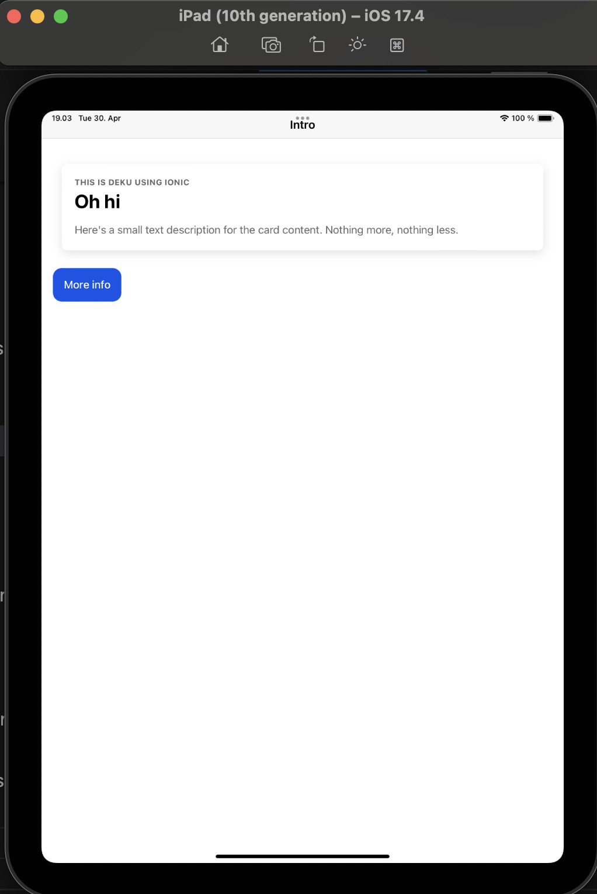

# purescript-deku-ionic

Build and ship deku apps on iOS and Android for fun and profit, courtesy of [ionic](https://ionicframework.com/).

## Desktop

## iPad

## Example

[example](./example)

You can use this as a template. I've tried to make it as barebones as possible while still having both android and ios. Basically, you can delete the [example/ios](./example/ios/) and [example/android](./example/android/) directory and run `pnpm run:ios` or `pnpm run:android` and they'll regenerate automatically for you courtesy of capacitor.

## Live demo please

Well, since you said please, the [example](./example) is live [here](https://purescript-deku-ionic.surge.sh).